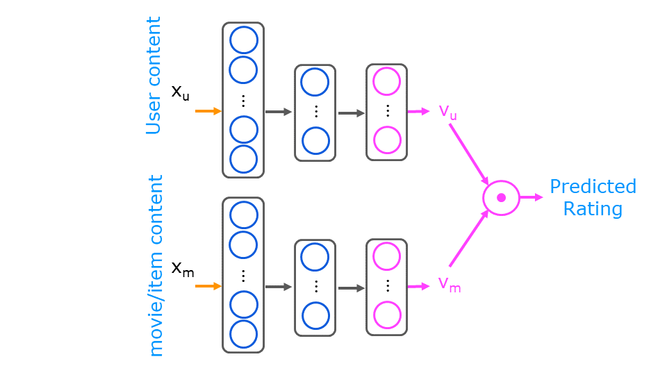

# Movie-Recommender

In this project, we will see implementation of recommendation algorithm for content filtering

#  Movie Recommender Systems

In this exercise, you will implement content-based filtering using a neural network to build a recommender system for movies. 

# Outline 
- [ 1 - Packages](#1)
- [ 2 - Movie ratings dataset](#2)
- [ 3 - Intro: Content-based filtering with a neural network](#3)
- [ 4 - Preparing the training data](#4)
- [ 5 - Modelling Neural Network for content-based filtering](#5)
- [ 6 - Model Evaluation](#6)
    - [ 6.1 Prediction for New User](#6.1)
    - [ 6.2 Finding Similar Items](#6.2)
- [ 7 - Model Evaluation](#7)

## Intro - Content-based filtering with a neural network

There are two types of `Recommendation system`
1. Collaborative filtering
2. Content-based filtering

The goal of a *Collaborative filtering* recommender system is to generate two vectors: For each user, a 'parameter vector' that embodies the movie tastes of a user. For each movie, a feature vector of the same size which embodies some description of the movie. The dot product of the two vectors plus the bias term should produce an estimate of the rating the user might give to that movie.

*Content-based filtering* generates a user and movie feature vector and recognizes there may be other information available about the user and/or movie that may improve the prediction. The additional information is provided to a neural network which then generates the user and movie vector as shown below.

<figure>
    
 

</figure>

The movie content provided to the network is a combination of the original data and some 'engineered features'. The original features are the year the movie was released and the movie's genre presented as a one-hot vector. There are 14 genres. The engineered feature is an average rating derived from the user ratings. Movies with multiple genre have a training vector per genre. 

The user content is composed of only engineered features. A per genre average rating is computed per user. Additionally, a user id, rating count and rating average are available, but are not included in the training or prediction content. They are useful in interpreting data.

The training set consists of all the ratings made by the users in the data set. The user and movie/item vectors are presented to the above network together as a training set. The user vector is the same for all the movies rated by the user. 

Below, let's load and display some of the data.
